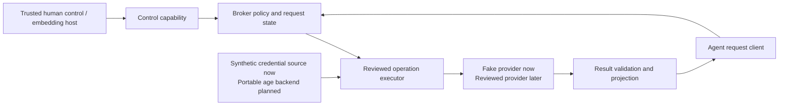

# Architecture

## Status and intended product

Aegis is a local capability broker. The current checkpoint implements an in-memory synthetic Rust core, a Unix foreground workflow with separate terminal control and agent socket, and a thin stdio MCP client. The portable operational vault, protected human-presence mechanism, and live provider connection remain subsequent gates. An optional age module separately demonstrates saved-fixture recovery without becoming broker authority.

The agent requests an operation, not a credential. A human-controlled authority delegates a fixed resource and bounded effects. The broker resolves the current protected policy, reserves authority, invokes a reviewed adapter, validates its response, and returns an explicit projection.



The Rust embedding host can hold both handles. Only the agent handle belongs on the agent-facing wire. The foreground executable retains control and exposes an agent-only Unix socket; its separate terminal can inspect and approve exact requests. This is a workflow boundary under a trusted account. A stronger deployment must independently establish that the agent cannot automate control or bypass the broker.

## Module responsibilities

| Module | Responsibility | Must not become |
| --- | --- | --- |
| `types` | Explicit identifiers, bindings, limits, request/result/error types | A catch-all serialized secret blob |
| `broker` | Session authority, prepare/approval state, exact revalidation, reservation/revoke serialization, scoped status | A client-controlled permission evaluator |
| `fake` | Fixed synthetic credentials and deterministic local provider behavior | A route to real credentials or live calls |
| `protocol` | Bounded parsing and serialization of the agent contract | Another policy engine or control channel |
| `ipc` | New private Unix endpoint, current-UID checks, bounded I/O, per-broker epoch | Proof against same-account code or hostile path races |
| `mcp` | MCP 2025-11-25 initialization, fixed tools, policy-free broker mapping | Credential custody, broker startup, or independent authorization |
| `storage` (optional) | Fixed synthetic age/recovery feasibility experiment | An operational vault or imported grant authority |
| CLI | Demo, JSON-lines fixture, foreground control, MCP client | An agent-mediated unlock or generic process runner |

Names and public signatures in this checkpoint are experimental. Read rustdoc and the tested source for exact types. Security-relevant changes to a public type require contract review even before a stable semantic-versioning promise exists.

## Authority and execution

The broker owns principal/session binding. Agent text such as a role, model, client name, or `approved=true` cannot establish identity or consent. Prepared IDs and run IDs are scoped lookup handles; knowing one does not authorize use.

All security-relevant dispatch checks and remaining-use reservation happen under the same broker-owned synchronization domain as revocation. The executor runs outside the state lock, after the dispatch decision has committed. This preserves the serialization point without holding a global lock across external execution. Already dispatched work may finish after revoke.

The first budget is per session and in memory. Terminating the broker invalidates that session and its authority. A later persistent budget needs a durable pre-effect journal and explicit recovery/rollback semantics; saving a snapshot counter after a call is insufficient.

## Implemented synthetic process layout

```text
Human's terminal
    -> control stdin of explicitly started synthetic foreground broker

Agent host
    -> thin stdio MCP client adapter
    -> current-UID-checked local agent endpoint
    -> same broker policy implementation

Foreground broker
    -> fixed synthetic credential source
    -> fixed synthetic status adapter
    -> bounded validated result
```

`aegis mcp --socket <absolute-path>` contains no credentials or keys, does not start a broker, and uses the operation protocol through `SocketBridge`. It supports MCP 2025-11-25 `initialize`, `ping`, `tools/list`, and six fixed `tools/call` names. Stdout is protocol-only; stderr is also observable by the host and is not private. This narrow tested adapter is not a broad MCP-host compatibility claim.

The server and bridge require the current effective UID through macOS `getpeereid` or Linux `PeerCredentials`; only macOS is tested. The endpoint is a new directory created with mode `0700`; existing destinations, relative paths, and symlink components are rejected. Up to eight active connections have bounded frame I/O. These path checks are not atomic directory-handle traversal and do not contain a hostile same-account writer.

Each broker generates a random 128-bit epoch greeting. A bridge caches it and rejects a changed epoch after restart, preventing that bridge from silently following reused numeric handles into a new session. The epoch is not a bearer authorization or protection against a malicious same-account server. All current socket clients share one broker-bound principal/session; no multi-principal durable authority is claimed.

The foreground process requires terminal stdin by default. `inspect ID` caches canonical review; `approve ID` requires that exact review still match. EOF, `stop`, command exhaustion, idle expiry, or maximum expiry invalidates authority. The explicit `--synthetic-control-pipe` flag exists for test harnesses and provides no human-presence evidence. A future protected approval adapter and durable multi-broker policy need separate designs.

## Portable backend direction

Keep key providers distinct from credential sources. A key provider unlocks a storage backend; a credential source provides the selected exact credential to an operation. Native unlock convenience should not erase differences in human presence, lock behavior, or portable recovery.

The planned operational snapshot uses released Rust `age` encryption with a local recipient and separately held recovery recipient. The optional `storage-spike` feature uses age 0.11.1 to save and recover a fixed fixture; it is not connected to the broker and restores with grants disabled and sessions empty. See [the spike evidence](storage-spike.md). A passphrase-protected local identity and ordinary operational commits are unimplemented. No custom cryptography is planned. Public catalog/manifest metadata cannot select trust anchors, arbitrary identity paths, or providers.

Snapshot transactions, rekey, restore, strict creation permissions, symlink/reparse defense, resource limits, and OS durability remain design and fault-test work. Recipient encryption is not proof that a trusted policy writer authored a snapshot. Restore disables grants and sessions and uses a fresh destination.

## Deliberate compatibility

A future trusted-consumer runner may deliver plaintext through a controlled pipe or environment. That consumer and any code/configuration it loads join the trust boundary. A binary digest cannot establish that agent-writable scripts, plugins, imports, or dependencies are fixed. This path has no implementation or security guarantee in this checkpoint.

## Explicit exclusions

The initial architecture excludes remote access, root/system daemons, automatic startup/unlock, team synchronization, arbitrary plugins, automatic updating, generic credential reads, arbitrary execution, caller-selected URLs, and an execution sandbox. Platform containment is a separately tested deployment property.
