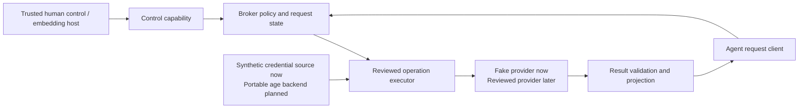
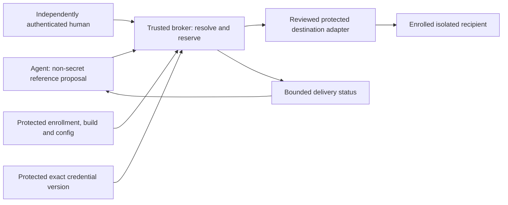

# Architecture

## Status and intended product

Aegis is an experimental local capability broker; protected agent-blind application delivery is required but not yet implemented or verified. The current checkpoint implements an in-memory synthetic Rust core, a Unix foreground workflow with separate terminal control and agent socket, and a thin stdio MCP client. The portable operational vault, protected human-presence mechanism, live provider connection and application-delivery enforcement remain subsequent gates. An optional age module separately demonstrates saved-fixture recovery without becoming broker authority.

For the implemented operation path, the agent requests an operation, not a credential. A human-controlled authority delegates a fixed resource and bounded effects. The broker resolves the current protected policy, reserves authority, invokes a reviewed adapter, validates its response, and returns an explicit projection. For the required future application-configuration path, the agent proposes secret references and non-secret intent; the broker delivers plaintext directly to an enrolled isolated recipient after separately authenticated human approval, with only safe status returned to the agent.



The Rust embedding host can hold both handles. Only the agent handle belongs on the agent-facing wire. The foreground executable retains control and exposes an agent-only Unix socket; its separate terminal can inspect and approve exact requests. This is a workflow boundary under a trusted account. A stronger deployment must independently establish that the agent cannot automate control or bypass the broker.

## Module responsibilities

| Module | Responsibility | Must not become |
| --- | --- | --- |
| `types` | Explicit identifiers, bindings, limits, request/result/error types | A catch-all serialized secret blob |
| `broker` | Session authority, prepare/approval state, exact revalidation, reservation/revoke serialization, scoped status | A client-controlled permission evaluator |
| `fake` | Fixed synthetic credentials and deterministic local provider behavior | A route to real credentials or live calls |
| `protocol` | Bounded parsing and serialization of the agent contract | Another policy engine or control channel |
| `ipc` | New private Unix endpoint, current-UID checks, bounded I/O, per-broker epoch | Proof against same-account code or hostile path races |
| `mcp` | MCP 2025-11-25 initialization, fixed tools, policy-free broker mapping | Credential custody, broker startup, or independent authorization |
| `github` | Fixed synthetic personal GitHub App adapter exercise, private token/signing/transport types, safe reports | A live key-input path, parallel production policy engine or credential helper |
| `signing` (optional) | Disposable-key sign-only source, strict RS256 verification and private one-shot approval-bound synthetic composition | An operational vault, exported signer/JWT, agent tool or live GitHub path |
| `storage` (optional) | Fixed synthetic age/recovery feasibility experiment | An operational vault or imported grant authority |
| CLI | Demo, JSON-lines fixture, foreground control, MCP client | An agent-mediated unlock or generic process runner |

Names and public signatures in this checkpoint are experimental. Read rustdoc and the tested source for exact types. Security-relevant changes to a public type require contract review even before a stable semantic-versioning promise exists.

## Authority and execution

The broker owns principal/session binding. Agent text such as a role, model, client name, or `approved=true` cannot establish identity or consent. Prepared IDs and run IDs are scoped lookup handles; knowing one does not authorize use.

All security-relevant dispatch checks and remaining-use reservation happen under the same broker-owned synchronization domain as revocation. The executor runs outside the state lock, after the dispatch decision has committed. This preserves the serialization point without holding a global lock across external execution. Already dispatched work may finish after revoke.

The first budget is per session and in memory. Terminating the broker invalidates that session and its authority. A later persistent budget needs a durable pre-effect journal and explicit recovery/rollback semantics; saving a snapshot counter after a call is insufficient.

## Implemented synthetic process layout

```text
Human's terminal
    -> control stdin of explicitly started synthetic foreground broker

Agent host
    -> thin stdio MCP client adapter
    -> current-UID-checked local agent endpoint
    -> same broker policy implementation

Foreground broker
    -> fixed synthetic credential source
    -> fixed synthetic status adapter
    -> bounded validated result
```

`aegis mcp --socket <absolute-path>` contains no credentials or keys, does not start a broker, and uses the operation protocol through `SocketBridge`. It supports MCP 2025-11-25 `initialize`, `ping`, `tools/list`, and six fixed `tools/call` names. Stdout is protocol-only; stderr is also observable by the host and is not private. This narrow tested adapter is not a broad MCP-host compatibility claim.

The server and bridge require the current effective UID through macOS `getpeereid` or Linux `PeerCredentials`; the full workflow was tested on macOS; a later Linux socket-pair check passed but listener-dependent checks are blocked in the cloud execution context. The endpoint is a new directory created with mode `0700`; existing destinations, relative paths, and symlink components are rejected. Up to eight active connections have bounded frame I/O. These path checks are not atomic directory-handle traversal and do not contain a hostile same-account writer.

Each broker generates a random 128-bit epoch greeting. A bridge caches it and rejects a changed epoch after restart, preventing that bridge from silently following reused numeric handles into a new session. The epoch is not a bearer authorization or protection against a malicious same-account server. All current socket clients share one broker-bound principal/session; no multi-principal durable authority is claimed.

The foreground process requires terminal stdin by default. `inspect ID` caches canonical review; `approve ID` requires that exact review still match. EOF, `stop`, command exhaustion, idle expiry, or maximum expiry invalidates authority. The explicit `--synthetic-control-pipe` flag exists for test harnesses and provides no human-presence evidence. A future protected approval adapter and durable multi-broker policy need separate designs.

## Portable backend direction

Keep key providers distinct from credential sources. A key provider unlocks a storage backend; a credential source provides the selected exact credential to an operation. Native unlock convenience should not erase differences in human presence, lock behavior, or portable recovery.

The planned operational snapshot uses released Rust `age` encryption with a local recipient and separately held recovery recipient. The optional `storage-spike` feature uses age 0.11.1 to save and recover a fixed fixture; it is not connected to the broker and restores with grants disabled and sessions empty. See [the spike evidence](storage-spike.md). A passphrase-protected local identity and ordinary operational commits are unimplemented. No custom cryptography is planned. Public catalog/manifest metadata cannot select trust anchors, arbitrary identity paths, or providers.

Snapshot transactions, rekey, restore, strict creation permissions, symlink/reparse defense, resource limits, and OS durability remain design and fault-test work. Recipient encryption is not proof that a trusted policy writer authored a snapshot. Restore disables grants and sessions and uses a fresh destination.

## Required protected application delivery

Protected application delivery is a required product path. The [delivery design](application-delivery.md) defines proposed reference-only workflows, immutable approval bindings, protected destinations and adversarial gates. No delivery type, method, recipient enrollment, installation or confinement check is implemented in this checkpoint.



This diagram is design only. The broker and recipient require an OS boundary that prevents agent reads of files/stores, memory, environment and descriptors/handles, and prevents agent modification of recipient code, dependencies, launch policy and security-relevant configuration. Separate service identities or an actually confined agent plus a protected recipient and independent human control are candidates. An unrestricted same-UID agent or agent-controlled container/debug interface is unsupported. The recipient must not load mutable security-relevant configuration from the agent workspace. A digest, file mode `0600`, peer UID or output redaction alone is insufficient; unsupported boundaries must fail closed.

Approved destinations are enrolled protected file slots, direct descriptors/handles, or native credential-store items, never arbitrary agent-selected paths. Credential values cannot enter general process environment or command arguments. File installation must use the enrolled object/namespace and address symlink/hardlink, parent/mount races, atomic replacement and recovery. Unknown handoff outcomes retain consumed authority without automatic retry. Future-delivery revocation, local cleanup, recipient termination and provider revocation are distinct; delivered plaintext cannot be retracted.

## Explicit exclusions

The implemented foundation excludes remote access, root/system daemons, automatic startup/unlock, team synchronization, arbitrary plugins, automatic updating, generic credential reads, arbitrary execution, caller-selected URLs, and an execution sandbox. Future protected-service arrangements require separately authorized enrollment and platform testing; this design does not install services or change permissions. Platform containment is a separately tested deployment property and a prerequisite for protected application delivery.

## GitHub preparation boundary

The separate [GitHub App experiment](github-app.md) models a narrowed installation-token exchange and metadata read using built-in fixtures. The initial fixture did not reuse the issue-status shape. The later [versioned core integration](github-broker.md) introduces typed GitHub contracts and explicit V2 wire/MCP mode while preserving issue-status compatibility. All token-bearing types are private; the original public work entry point is a fixed synthetic demo; the subsequent journal drill adds fixed create/read-only-inspect functions described below. Its simulated approval/reservation/uncertainty state is test scaffolding. Integrating a live operation requires a versioned contract using the existing broker authority, independently authenticated human approval, protected custody and OS isolation, and durable pre-mint intent. The original fixture uses mock JWTs; the later optional composition below signs with disposable keys. No key import, HTTP client or Git execution is implemented.

## Synthetic retained GitHub intents

The optional path-taking GitHub journal drill writes only fixed synthetic metadata through a private Unix append/sync journal. It orders reservations and effect intents before mock provider calls, requires a durable terminal before success, and uses an OS file lock plus strict transition decoding. Its public restart path is inspection-only, restores zero grants/sessions, and cannot execute from an existing journal. No credential bytes, protected operational custody, writer authentication or rollback defense is added. See [ADR 0009](adr/0009-synthetic-durable-github-intents.md) and [the journal contract](github-intent-journal.md).

## Versioned core integration

[ADR 0010](adr/0010-versioned-synthetic-github-broker.md) makes the main broker the sole authority for the fixed GitHub metadata operation. Legacy wrappers reject GitHub handles before action; the V2 path requires exact reviewed control approval. A private non-Clone reserved item connects the core serialization point to the adapter, with journal sync before provider work. Schema 2 binds actual broker context and budgets; schema 1 inspection remains supported. Live composition and an independently authenticated human/OS boundary remain unavailable.

## Optional signed-synthetic composition

[ADR 0012](adr/0012-approval-bound-synthetic-signing.md) adds an explicit optional constructor. After core reservation and schema-2 sync, a private permit binds the complete review and actual budget; a private signed envelope reaches only the fixed mock exchange. Cached reads need core approval but no new signing lease. All default constructors, CLI/MCP selection and live gates are unchanged. See [composition](github-signed-composition.md) and the [readiness checkpoint](readiness-checklist.md).

## Vendor-neutral network API direction

The default future network architecture is [application authentication followed by deny-by-default exact ACLs](access-control.md), retaining the main broker as the authority. A verified issuer/subject/enrollment binds a principal before policy evaluation; request labels, addresses and proxy/network claims cannot do so. Independent human administration owns enrollment, ACLs and approval. Operator-managed private networking and optional IP filters restrict reachability without granting authority or creating a vendor dependency. Future listener/TLS/proxy configuration must explicitly prove its trust and exposure boundaries. No HTTP server, authentication adapter or configurable ACL engine is implemented by ADR 0013; local synthetic constructors and Unix behavior are unchanged.

## Request-driven delivery lifecycle

[ADR 0014](adr/0014-request-driven-delivery-lifecycle.md) makes episodic project setup and secret delivery/rotation the primary product flow. A wake-on-request-compatible broker can become idle after a durable outcome while the enrolled recipient uses its provider directly. Optional bounded API mediation remains a distinct mode. Protected revocation/approval/use state, fresh cold-start authentication and epochs, rollback rejection, concurrent-wake fencing and unknown-handoff reconciliation are prerequisites; current volatile sessions and inspection-only journals do not implement them. [The delivery contract](application-delivery.md#request-driven-lifecycle) preserves the limits of revoking already delivered credentials.

## Integrated synthetic vault delivery

[ADR 0015](adr/0015-integrated-synthetic-vault-delivery.md) adds an optional delivery operation to the main policy engine. An opaque authenticated client capability gates stateful agent methods; separate purpose-bound proofs gate canonical approval and dispatch inside the core lock. Signed manifest/ACL, age-encrypted records, a private encrypted recipient fixture, signed acknowledgements and durable consumed history form one [synthetic path](vault-delivery-spike.md). It is not a real application/HTTP/entry adapter. The fixture kit/anchor remains vulnerable to same-UID access and coherent rollback; production requires the [operator-owned boundary](operator-owned-deployment.md).
