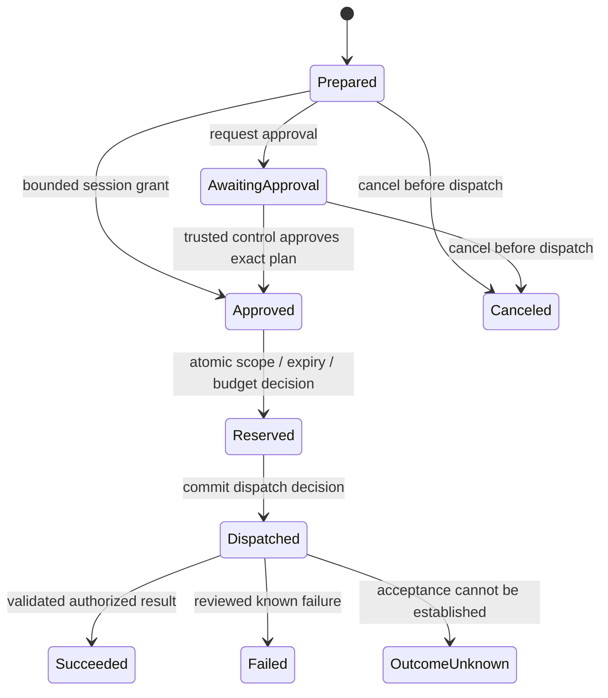

# Product and policy contracts

This document separates the synthetic foundation's intended invariants from future release requirements. The executable tests and [verification record](verification.md) determine what has actually been demonstrated. No contract below authorizes real credentials, provider calls, or production use.

## Authority objects

| Object | Meaning | Binding rule |
| --- | --- | --- |
| Credential record | Immutable administrative ID and exact version of opaque material | A grant never silently follows `latest` |
| Operation profile | Reviewed adapter, resource, inputs, output contract, and limits | Revision changes require rejection or new approval |
| Grant | Bounded authority for a broker-bound principal/session and profile | Authority is not inferred from an agent label |
| Prepared request | Resolved concrete operation and exact bindings at one policy generation | Its ID is a lookup handle, not bearer authority |
| Run | One dispatch decision and its outcome | Status lookup enforces the same principal/session scope |

A session pins the profile revision, resource, implementation contract, credential ID/version, output contract, and protected policy generation. Prepare also pins canonical concrete parameters and expiry. Dispatch revalidates these bindings against current broker state. A different revision, account, resource, output shape, or expired request must not inherit an old approval.

Exact versions are the initial default. A future rotation alias must demonstrate equivalent resource and authority bindings or require reapproval. An opaque token cannot prove its issuer permissions by inspecting its bytes.

## Human and agent channels

The trusted control capability creates the synthetic frozen authority, reviews a resolved request, approves it, revokes the grant, and stops the session. The foreground CLI implements terminal `inspect ID`, `approve ID`, `cancel ID`, `revoke`, and `stop`; `approve_reviewed` compares the cached canonical plan, prepared handle, broker instance, and remaining uses in the same critical section that approves. The lower-level embedding `approve` capability does not attest to a displayed review. The agent client can discover, prepare, request approval, invoke, cancel a request before dispatch, and inspect scoped status. Scope denial returns an error rather than a retained `denied` lifecycle state.

The agent-facing contract has no raw-secret read, generic execution, arbitrary HTTP/URL route, recipient change, export, or human approval method. Unknown fields such as `approved=true` must not become authority. Client-provided identity strings are display data only.

An agent approval request creates or refers to bounded pending state. It does not approve the request or attest to human presence. The current JSON-lines fixture leaves the request `awaiting_approval` and invocation returns `approval_required`; it has no private control connection. An integrated broker must return `interaction_required` where no supported human interaction is available. Neither path may prompt for passwords or ask for credentials in chat.

The synthetic demo uses a trusted Rust embedding control handle. The foreground CLI separates terminal control from an agent-only Unix socket, requiring terminal stdin by default; `--synthetic-control-pipe` is an explicit test facility. EOF invalidates the session. Both approaches demonstrate agent API separation, without proof that a human acted or that same-user automation cannot reach an administrative interface.

## Discovery and resolved planning

Any discovery sourced from a public catalog is explicitly unverified. It may advertise names/input shapes, but cannot certify authorization, current credential context, or authoritative scope.

The approval display must use the broker-resolved plan. Display security-relevant fields independently from agent-written rationale: requesting host/session, operation/resource, concrete inputs or permitted range, credential label/account context, effects, result categories, expiry/use limits, and enforcement mode. Escape control characters and misleading rich-text content. A cached agent preview is not consent.

The synthetic fixture has broker-owned policy rather than a public storage catalog. The foreground `inspect` display renders the resolved synthetic operation/resource/input, profile revision, credential version, output contract, policy generation, expiry, remaining uses, effects/result categories, session limits, and workflow mode. No locked-vault discovery or account-aware real-provider approval UI is implemented.

## Request lifecycle

The diagram specifies the logical lifecycle; implementations combine `Reserved` and `Dispatched` inside one serialized transition. Scope denial, cancellation, expiry, and stop before dispatch prevent a new dispatch. The prepared-request deadline applies only before dispatch. Approval, cancellation, expiry checks, and retries cannot overwrite dispatched or terminal states. The already accepted invocation may return its validated completion after revocation or session expiry; it cannot refresh an expired session. Later result lookup/replay requires a valid session and retention limit. A missing record is not proof that a prior external effect did not happen.

## Atomic use reservation and revoke

Inside one broker-owned critical section:

1. Check principal/session, session lifetime, grant state, request state, exact bindings, input scope, and remaining uses.
2. Resolve an existing run for a retry, or reserve one remaining use exactly once.
3. Bind the run to the prepared request and commit the dispatch decision.

Grant revocation commits in the same synchronization domain. After revoke wins that serialization point, new dispatch reservations fail. If dispatch wins first, that operation may complete. Revocation is not a promise to retract a provider action or previously delivered plaintext.

Two concurrent distinct requests racing for one final use must produce at most one reservation and one dispatch. Two invocations of the same prepared request must refer to one run, not independently reserve two uses. Provider execution occurs after the decision, outside the state lock.

Session-local counters are not durable global budgets. Restart requires a new control authorization; an old grant or run ID cannot resume authority implicitly. A random per-broker epoch greeting makes an existing socket bridge reject a restarted broker rather than follow reused numeric handles. All current socket clients share one broker-bound principal/session. A persistence design must reserve durably before an effect and identify crash/rollback semantics before advertising cross-restart limits.

## Idempotency and unknown outcomes

The deduplication key is broker-bound principal/session plus caller request ID. Compare canonical typed parameters and exact resolved bindings, rather than hashing arbitrary JSON text and treating formatting as policy.

| Situation | Required behavior |
| --- | --- |
| Same ID, same prepared inputs/bindings | Return existing prepared/run state or result |
| Same ID, different canonical inputs | `request_id_conflict`; no new dispatch |
| Invocation while the same run is dispatched | Return in-progress state; do not dispatch again |
| Retry after success | Return the stored validated result; do not repeat the effect |
| Known failure after reservation | Preserve the run and consumed reservation unless a separately specified safe refund rule exists |
| Provider acceptance uncertain, panic, or lost receipt | Preserve consumed authority; `outcome_unknown`; no blind repeat |
| Broker restart | Old session authority invalid; no implicit resumption |

Exactly-once local reservation is different from exactly-once provider effects. A later write adapter requires provider idempotency or explicit reconciliation. An unknown result must not be converted into `provider_unavailable` followed by a transparent retry. Human reconciliation may be necessary even after local restart.

## Session and time semantics

The current synthetic setup enforces a default 600-second idle and 1,800-second maximum session; trusted setup can impose shorter limits. Tests use an injected clock. The foreground loop checks validity as well as its maximum duration. These process-local limits do not establish platform suspend/lock guarantees.

Use a broker-owned clock abstraction for deterministic expiry tests and a monotonic production time source for process-local duration. Only a successful authorized activity may refresh idle time. Denials, approval requests, discovery, and status polling must not extend authority. Absolute maximum lifetime never extends.

Invalidate the session when lifecycle state becomes untrustworthy. Suspension, screen lock, clock behavior, logout, and headless interaction require platform tests before supported behavior is promised. No auto-start, reboot unlock, or background service is part of this foundation.

## Inputs and outputs

Start with one fixed fake status operation whose inputs select a bounded issue/resource. The adapter supplies the endpoint/authentication/route in later network implementations. An agent cannot provide an auth header, raw URL, route template, secret reference, or process command through a convenience field.

Return a typed, bounded projection such as numeric issue ID and enumerated state. Validate the provider response before release. Wrong ID/resource, unexpected status enum, oversize content, malformed schema, or unsupported output version produces a reviewed error. No raw response, headers, native exception, or arbitrary provider content is returned by default.

Output contracts are information-release decisions. They are not a general-purpose secret detector. A future text-returning operation needs its own data-access grant and explicit treatment of provider/user text as untrusted. Generic redaction is not the security mechanism.

## Bounds

Every shipped interaction needs concrete tested limits on request bytes, identifier lengths, parameter values, pending requests, retained results, approval prompts, concurrent dispatches, response bytes, and execution duration. Current synthetic limits include 64-byte ASCII identifiers, at most 128 retained requests, at most four concurrent dispatches, at most 1,000 granted uses, at most 600-second idle/1,800-second maximum sessions, and at most 15-second prepared-request lifetime. The protocol allows 16 KiB frames including the mandatory LF and 256 frames per connection. Unix transport permits eight active connections, a one-second absolute deadline to receive each frame, and a one-second write-syscall timeout; the bridge uses two-second greeting/response read deadlines. Socket paths are limited to 100 bytes before creation; terminal control permits 128 commands of at most 256 bytes. The current code's constants and tests are authoritative; future vault limits and actual execution deadlines are not established by these bounds.

The design's 16 MiB snapshot and 64 KiB secret limits are measurement candidates. They must be evaluated against allocation behavior, parser nesting, age header/work-factor limits, and target memory before becoming storage promises.

## Stable non-sensitive errors

| Code or category | Agent action |
| --- | --- |
| `approval_required` / `interaction_required` | Pause; let the supported trusted control flow act; never supply credentials |
| `scope_denied` / `principal_mismatch` | Stop this request; ask the human for a separately reviewed grant if needed |
| `request_expired` / session expiry | Prepare a new request only within newly valid authority |
| `budget_exhausted` / revoked grant | Stop; a retry does not create new authority |
| `request_id_conflict` | Fix caller bookkeeping; do not reuse an ID for changed inputs |
| stale exact binding | Reprepare and obtain new approval; do not substitute a newer credential |
| reviewed provider/output failure | Inspect scoped state; do not print raw provider content |
| `outcome_unknown` | Reconcile through the trusted workflow; do not blindly repeat |
| malformed/oversize/unsupported protocol | Correct the request using the documented version and limits |

Exact wire codes are experimental; see the tested protocol types for the current set. Error text is not a transport for credentials, full requests, or provider bodies.

## Persistent-secret gate

Planned operational persistent setup transitions `uninitialized -> pending_recovery -> ready`. Only a fresh process restoring the saved snapshot with independently saved recovery material may satisfy the recovery gate. The generating process decrypting its own canary with a retained key is insufficient. The optional [synthetic age spike](storage-spike.md) demonstrates fresh-process fixed-fixture recovery, but does not set any operational state to `ready` or satisfy the real-secret gate.

Restore must use a new destination, validate schema/vault identity, and disable imported grants/sessions. Changing a recovery recipient invalidates earlier verification. Real-secret persistence remains unavailable until the recovery, custody, transaction, and platform gates are demonstrated. A synthetic demo cannot report production readiness.
